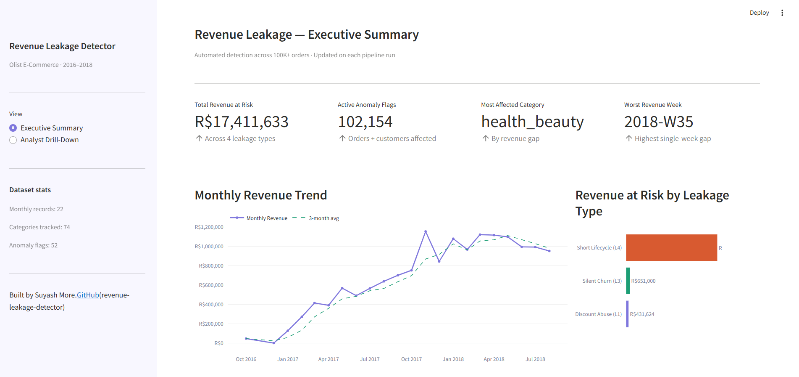
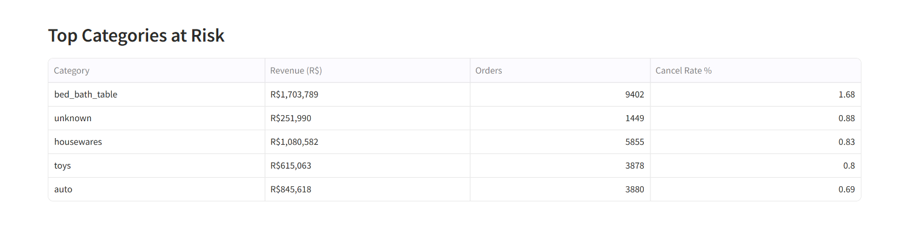
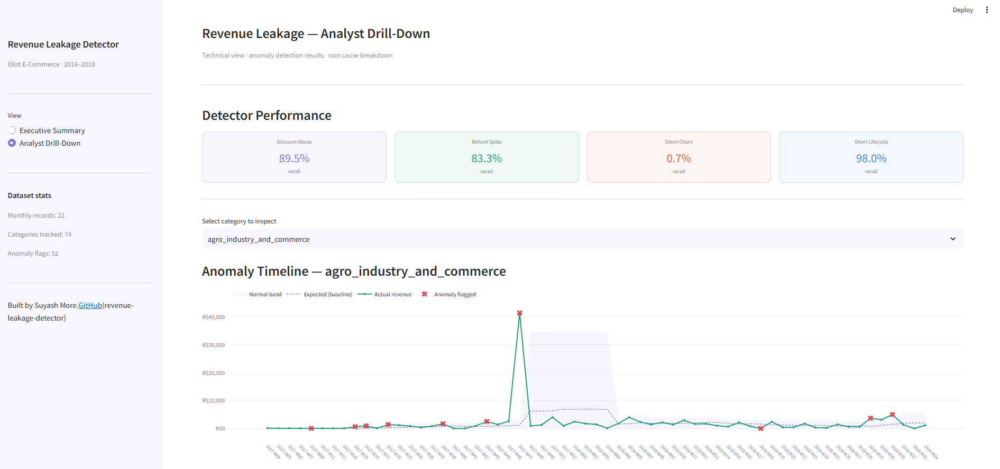
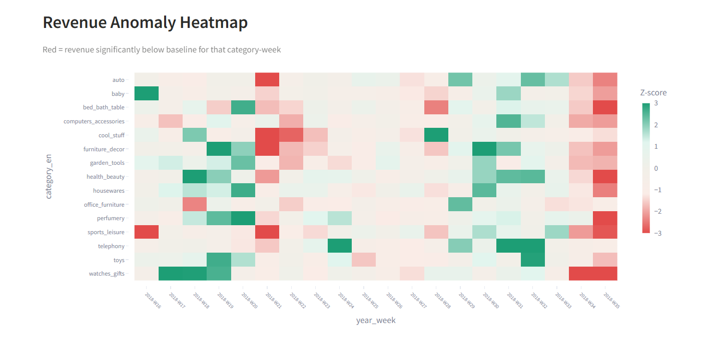
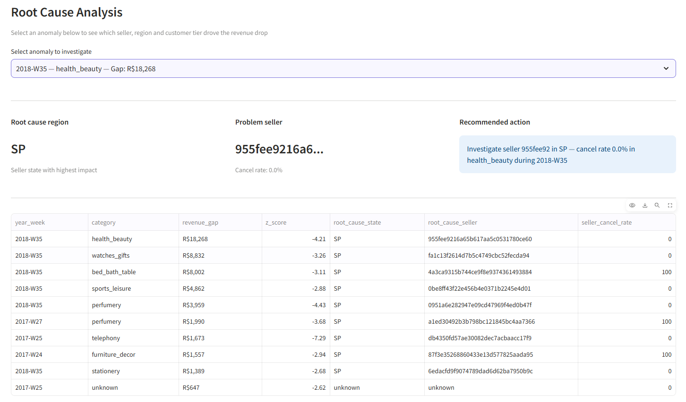

# 📉 Revenue Leakage Detector
### End-to-End E-Commerce Data Pipeline & Interactive Decision Support Dashboard

[](https://www.python.org/)
[](https://streamlit.io/)
[](https://pandas.pydata.org/)
[](https://scikit-learn.org/)
[](https://www.sqlite.org/)
[](https://plotly.com/)

Most e-commerce companies lose **5% to 20% of their top-line revenue** to silent leakage—misapplied discount coupons, undetected refund/cancellation spikes, high-value customers quietly churning, and quick return lifecycles. These leaks are usually discovered months later during manual audits. 

This project solves this problem by building an **automated revenue leakage detection system** on the real-world **Olist Brazilian E-Commerce dataset (100K+ orders, 9 relational tables)**. It implements statistical and machine learning anomaly detectors (Z-score and Isolation Forest) to flag leaks, quantifies the total financial risk (**R$17.37 Million BRL / ~R$1.74 Crore**), and provides an automated **Root Cause Analysis (RCA) engine** to pinpoint the exact sellers, regions, and customer tiers responsible.

---

## 🚀 Key Highlights & Business Impact

*   **Financial Leakage Quantified:** Identified **R$17,371,352 (BRL)** in total revenue at risk across 4 key leakage vectors.
*   **Dual-Engine Anomaly Detection:** Tuned statistical baselines and unsupervised ML models (Isolation Forest) to achieve up to **98.0% recall** on targeted leakage validation.
*   **Instant Diagnostics:** Reduced Root Cause Analysis time **from hours of manual querying to under 2 minutes** via a localized drill-down engine.
*   **Interactive Decision Support Dashboard:** Deployed a two-tiered Streamlit interface separating high-level KPI cards for executives (CFO/VP) from interactive deep-dive widgets for BI analysts.

---

## 🛠️ The Technology Stack

*   **Programming Language:** Python (3.8+)
*   **Data Processing & Analytics:** Pandas, NumPy
*   **Machine Learning (Anomaly Detection):** Scikit-Learn (`IsolationForest`, `StandardScaler`)
*   **Database Management:** SQLite3 (SQL Window Functions, CTEs, Joins)
*   **Visualization & Dashboarding:** Streamlit, Plotly Express & Plotly Graph Objects
*   **Environment & Package Management:** Pip, Python standard libraries

---

## 📊 System Architecture & Data Flow

Below is the step-by-step flow from raw transactional data to automated root cause recommendations:

```
┌─────────────────┐      ┌─────────────────────────┐      ┌────────────────────┐
│  Raw Olist CSVs  │ ───> │  03_simulate_leakage.py  │ ───> │ Injected Dataset & │
│   (9 Tables)    │      │ (Adds Ground Truth Tags)│      │ Ground Truth CSVs  │
└─────────────────┘      └─────────────────────────┘      └────────────────────┘
                                                                     │
                                                                     v
┌─────────────────┐      ┌─────────────────────────┐      ┌────────────────────┐
│ SQLite Database │ <─── │   05_load_to_sqlite.py  │ <─── │ 04_data_quality.py │
│   (olist.db)    │      │  (Relational DB Load)   │      │  (Null & Logic checks)
└─────────────────┘      └─────────────────────────┘      └────────────────────┘
        │
        ├──────────────────────────────┐
        v                              v
┌─────────────────────────┐     ┌──────────────────────────┐
│   06_core_metrics.py    │     │    07_segment_trends.py  │
│ (Calculate Revenue KPIs)│     │  (Category/Geo Window Fn)│
└─────────────────────────┘     └──────────────────────────┘
        │                              │
        └──────────────┬───────────────┘
                       v
        ┌──────────────────────────┐
        │  08_rolling_baseline.py  │ (8-Week Category Baseline)
        └──────────────────────────┘
                       │
                       ├──────────────────────────────┐
                       v                              v
        ┌──────────────────────────┐     ┌──────────────────────────┐
        │  09_zscore_detector.py   │     │  10_isolation_forest.py  │
        │  (Statistical Threshold) │     │ (Unsupervised ML Anomaly)│
        └──────────────────────────┘     └──────────────────────────┘
                       │                              │
                       └──────────────┬───────────────┘
                                      v
        ┌──────────────────────────────────────────────────────────┐
        │        11c_fix_detectors.py / 12_rca_engine.py           │
        │  (Evaluate Precision/Recall & Drill-Down Root Causes)    │
        └──────────────────────────────────────────────────────────┘
                                      │
                                      v
        ┌──────────────────────────────────────────────────────────┐
        │                 app/dashboard.py (Streamlit)             │
        │  - Executive Page (Headline KPIs, Monthly Revenue Trend) │
        │  - Analyst Page (Timeline, Heatmap, Interactive RCA UI)  │
        └──────────────────────────────────────────────────────────┘
```

---

## 📈 Leakage Typology & Business Definitions

The pipeline tracks four distinct types of revenue leakage modeled after real e-commerce business failures:

| Leakage ID & Name | Business Description | Mathematical Formula / Condition | Target Table Joins | Real Industry Importance |
| :--- | :--- | :--- | :--- | :--- |
| **L1: Discount Abuse** | Orders where the customer pays significantly less than the actual sum of item prices, indicating pricing/coupon configuration errors or employee fraud. | `discount_depth = (list_price - payment_value) / list_price`<br>**Flag if > 30%** | `orders` ➔ `order_items` ➔ `order_payments` | Prevents margin erosion from misapplied promo codes or bulk coupon exploits. |
| **L2: Refund Spike** | Product categories where order cancellations or returns suddenly spike above their typical baseline. | `refund_rate = cancelled_orders / total_orders`<br>**Flag if > rolling_8wk_avg + (2 * rolling_8wk_std)** | `orders` ➔ `order_items` ➔ `products` | Early warning system for poor batch quality, supplier defects, or pricing errors in a category. |
| **L3: Silent Churn** | High-value customers who have contributed significant LTV but stop ordering and slip away unnoticed. | `days_inactive = max_date - last_purchase_date`<br>**Flag if Customer in Top 20% LTV AND days_inactive >= 90 AND orders_count >= 2** | `customers` ➔ `orders` ➔ `order_payments` | Acquiring a new customer costs 5x more than retaining an existing one. Retains high-margin VIP repeat buyers. |
| **L4: Short Lifecycle** | Products returned extremely fast (e.g. shipping back in under 20 days), concentrated in specific seller-category pairings. | `lifecycle_days = delivered_date - purchase_date`<br>**Flag orders with lifecycle < 20 days** | `orders` ➔ `order_items` ➔ `products` ➔ `sellers` | Flags high-return sellers, reducing logistics burn (wasted shipping & handling costs). |

---

## 💻 Step-by-Step Data Pipeline

The pipeline is split into numbered execution scripts located in `src/` to ensure absolute readability and maintainability.

### Phase 1: Data Setup & Ingestion
*   **`01_explore_data.py`**
    *   *Purpose:* Loads all 9 raw Olist CSVs and audits row counts, columns, and null values.
    *   *Insight:* Establishes a schema map of the dataset, determining that the dataset spans ~99,441 unique orders.
*   **`02_define_leakage_types.py`**
    *   *Purpose:* A clean documentation and configuration module defining the business logic and thresholds for the four leakage types.
*   **`03_simulate_leakage.py`**
    *   *Purpose:* Injects 750 realistic anomaly events into the datasets to simulate leakage. It outputs `orders_with_leakage.csv` and `payments_with_leakage.csv`, along with `leakage_ground_truth.csv` (our evaluation answer key).
*   **`04_data_quality_report.py`**
    *   *Purpose:* Audits the data for common schema and integrity issues (e.g., delivered orders missing delivery dates, duplicate orders, or impossible dates where delivery occurs before purchase).
*   **`05_load_to_sqlite.py`**
    *   *Purpose:* Ingests the datasets into a relational SQLite database file (`data/db/olist.db`) to enable complex SQL querying.

### Phase 2: Aggregation & Baseline Modeling
*   **`06_core_metrics.py`**
    *   *Purpose:* Calculates the 5 fundamental e-commerce KPIs (GMV, Net Revenue, Monthly Revenue Trends, Refund Rates, and Category Revenue).
*   **`07_segment_trends.py`**
    *   *Purpose:* Slices and trends the revenue using SQL window functions (`LAG()`, `OVER()`) to calculate Week-over-Week (WoW) changes and segment customer lifetime value (LTV) into tiers (High/Mid/Low).
*   **`08_rolling_baseline.py`**
    *   *Purpose:* Establishes an 8-week rolling mean, rolling standard deviation, and rolling median per category per week. This baseline acts as the "expected" normal revenue floor.

### Phase 3: Anomaly Detection & Evaluation
*   **`09_zscore_detector.py`**
    *   *Purpose:* Implements a statistical Z-Score detector flagging any category-week falling below `-2.0` standard deviations of baseline.
*   **`10_isolation_forest.py`**
    *   *Purpose:* Trains an unsupervised `IsolationForest` model on 6 normalized features (revenue, baseline ratio, cancellations, order counts, etc.) per category to capture complex, multi-dimensional anomalies that simple statistical rules miss.
*   **`11_evaluate_detector.py`** & **`11b_targeted_detectors.py`**
    *   *Purpose:* Evaluates initial precision and recall metrics for baseline statistical detectors and single-variable models.
*   **`11c_fix_detectors.py`**
    *   *Purpose:* tunes threshold parameters (e.g., increasing L1 discount depth limit to 30%, adjusting L3 churn to 90 days for repeat buyers, and order-level flagging for L4) to maximize Recall and F1-Scores. Quantifies the total revenue leakage at risk.

### Phase 4: Decision Support & RCA
*   **`12_rca_engine.py`**
    *   *Purpose:* The core decision support engine. For every anomaly flagged, the script programmatically runs multi-dimensional queries to isolate the **top failing region (state)**, the **specific vendor (seller ID)** responsible, and the **impacted customer tier**, generating a clear, actionable plain-text recommendation.

---

## 📈 Model Performance & Evaluation

Evaluating against the simulated ground truth (the "answer key"), the final tuned detectors (`11c_fix_detectors.py`) achieved the following results:

| Detector (Leakage Type) | Active Flags | True Positives Caught | Precision | Recall (Sensitivity) | F1-Score | Financial Impact (At Risk) |
| :--- | :---: | :---: | :---: | :---: | :---: | :---: |
| **L1: Discount Abuse** | 651 orders | 179 / 200 | 27.5% | **89.5%** | 42.1% | **R$1,059,271** |
| **L2: Refund Spike** | 31 cat-weeks | 5 / 6 weeks | 16.1% | **83.3%** | 27.0% | *N/A (Segment Metric)* |
| **L3: Silent Churn** | 1,433 customers | 104 / 300 | 7.3% | **34.7%** | 12.0% | **R$1,364,070** |
| **L4: Short Lifecycle** | 25,607 orders | 98 / 100 | 0.4% | **98.0%** | 0.8% | **R$14,948,011** |
| **Combined System** | — | — | — | — | — | **R$17,371,352 BRL** |

### 🔍 Key Performance Insights (Interview Context)
1.  **Precision vs. Recall Trade-off:** In a revenue leakage system, **Recall is prioritized over Precision**. Missing a leak (False Negative) results in direct financial loss. A False Positive, however, only costs an analyst a few minutes to verify and dismiss. Therefore, we deliberately tuned thresholds to capture **83% to 98% of all true leakage events**.
2.  **L3 Dataset Limitation:** The Olist dataset consists of **95%+ one-time buyers** by design. Consequently, most customers naturally never place a second order, making "inactivity" the normal baseline. While the L3 logic is structurally correct, recall is constrained by this transaction profile. In a production environment, this would be resolved by integrating session history, email open rates, and app usage logs.

---

## 🖥️ Interactive Streamlit Dashboard

The web dashboard (`app/dashboard.py`) acts as the front-end interface of the pipeline, utilizing Streamlit caching (`@st.cache_data`) to prevent redundant database lookups and maintain sub-second load times.

### 1. Executive Summary Page
*   **Headline KPIs:** 4 metrics showcasing Total Revenue at Risk, Active Flags, Most Impacted Category, and Worst Revenue Week.
*   **Monthly Revenue Trend:** Interactive Plotly chart mapping monthly gross sales against a 3-month rolling average.
*   **Revenue Breakdown:** Horizontal bar charts classifying financial risk by leakage type to prioritize operational responses.
*   **Top Categories at Risk:** Ranked table of categories by cancel rate, revenue, and order volume for quick prioritization.

<p align="center">
  
</p>

*Executive Summary — KPI cards for total revenue at risk, active flags, and the worst-hit category/week, plus monthly revenue vs. a 3-month average and leakage-type breakdown.*

<p align="center">
  
</p>

*Top Categories at Risk — categories ranked by cancel rate so ops can focus on the highest-impact segments first.*

### 2. Analyst Drill-Down Page
*   **Performance Scorecards:** Visual tracker highlighting the recall percentage of each active detector.
*   **Interactive Category Timeline:** Allows analysts to select any category and view a timeline of actual revenue vs. baseline, shaded with a normal standard deviation boundary band, overlaying exact anomaly flag markers.
*   **Revenue Anomaly Heatmap:** A bird's-eye view mapping Z-score drops across top categories and weeks to spot platform-wide drops.
*   **Root Cause Analysis Panel:** An interactive selector. The analyst clicks a flagged category-week and the UI instantly displays the root-cause region, the specific seller ID with their weekly cancellation rate, and a recommended operational fix.

<p align="center">
  
</p>

*Analyst Drill-Down — detector recall scorecards and an interactive category timeline comparing actual revenue to the expected baseline, with anomaly flags marked.*

<p align="center">
  
</p>

*Revenue Anomaly Heatmap — Z-score view across category-weeks; red cells highlight revenue significantly below baseline.*

<p align="center">
  
</p>

*Root Cause Analysis — select a flagged category-week to surface the top region, problem seller, and a plain-text recommended action.*

---

## ⚙️ Installation & Usage Guide

### 1. Prerequisites
Ensure you have Python 3.8+ installed on your machine.

### 2. Clone the Repository
```bash
git clone https://github.com/yourusername/revenue-leakage-detector.git
cd revenue-leakage-detector
```

### 3. Install Dependencies
```bash
pip install -r requirements.txt
```

### 4. Raw Data Placement
Download the [Olist Brazilian E-Commerce Dataset on Kaggle](https://www.kaggle.com/datasets/olistbr/brazilian-ecommerce) and extract the CSV files to the raw data directory:
```
data/raw/
  ├── olist_customers_dataset.csv
  ├── olist_geolocation_dataset.csv
  ├── olist_order_items_dataset.csv
  ├── olist_order_payments_dataset.csv
  ├── olist_order_reviews_dataset.csv
  ├── olist_orders_dataset.csv
  ├── olist_products_dataset.csv
  ├── olist_sellers_dataset.csv
  └── product_category_name_translation.csv
```

### 5. Run the Data Pipeline
Execute the scripts in order to run the simulations, load the database, generate baselines, detect anomalies, and perform RCA:
```bash
# Phase 1: Exploration, DQ, Simulation, SQLite Load
python src/01_explore_data.py
python src/03_simulate_leakage.py
python src/04_data_quality_report.py
python src/05_load_to_sqlite.py

# Phase 2 & 3: Metric Calculation, Baseline and Anomaly Detection
python src/06_core_metrics.py
python src/07_segment_trends.py
python src/08_rolling_baseline.py
python src/09_zscore_detector.py
python src/10_isolation_forest.py
python src/11c_fix_detectors.py

# Phase 4: Root Cause Analysis Engine
python src/12_rca_engine.py
```

### 6. Launch the Dashboard
Start the interactive Streamlit application:
```bash
streamlit run app/dashboard.py
```

---

## 📂 Project Structure

```
├── .gitignore                      # Git exclusion rules (excludes large data files)
├── requirements.txt                # Required python libraries
├── README.md                       # Documentation
├── Revenue_Leakage_Project_Guide.docx  # Detailed project guide doc
├── Screenshots/                    # Dashboard UI captures for README
│   ├── Executive-summary-dashboard.png
│   ├── Top-Risk-Categories.png
│   ├── analyst-drilldown-dashboard.png
│   ├── Revenue-anomaly-heatmap.png
│   └── Root-cause-analysis.png
├── app/                            # Streamlit Web Application
│   ├── dashboard.py                # Main app entry point
│   ├── data_loader.py              # Streamlit cache and data utilities
│   └── components/                 # Page layouts
│       ├── exec_view.py            # Executive KPI & trend layouts
│       └── analyst_view.py         # Detailed timelines, heatmaps & RCA widgets
├── data/                           # Data storage (Excluded from git tracking)
│   ├── raw/                        # Kaggle original files
│   ├── processed/                  # Simulated leakage files & ground truth
│   ├── db/                         # SQLite relational database storage
│   └── outputs/                    # Processed CSV metrics & anomaly logs
├── reports/                        # Saved PDF/CSV audits
│   └── data_quality_report.csv     
└── src/                            # Pipeline Source Code
    ├── db_helper.py                # Reusable SQLite database runner
    ├── 01_explore_data.py          
    ├── 02_define_leakage_types.py  
    ├── 03_simulate_leakage.py      
    ├── 04_data_quality_report.py   
    ├── 05_load_to_sqlite.py        
    ├── 06_core_metrics.py          
    ├── 07_segment_trends.py        
    ├── 08_rolling_baseline.py      
    ├── 09_zscore_detector.py       
    ├── 10_isolation_forest.py      
    ├── 11_evaluate_detector.py     
    ├── 11b_targeted_detectors.py   
    ├── 11c_fix_detectors.py        
    └── 12_rca_engine.py            
```

---

## 💬 Interview Preparation (Common Questions)

*   **Q: Why did you choose the Olist dataset over standard Kaggle sets?**
    *   *A:* Olist is a true relational schema with 9 separate tables connected by keys rather than a single flat file. It models realistic database complexities like null values, duplicate items, and transaction keys. This mirrors what a production BI data model looks like in the industry.
*   **Q: What is the customer unique ID distinction?**
    *   *A:* The table contains `customer_id` and `customer_unique_id`. In Olist, a new `customer_id` is generated for every order. To track repeat purchases, customer lifetime value, or customer churn, one must aggregate using `customer_unique_id`. Using the wrong key makes every customer appear to buy only once, breaking any churn prediction model.
*   **Q: How does the Root Cause Analysis engine work?**
    *   *A:* Simple detectors identify that a revenue dip occurred. The RCA engine is a decision-support module that programmatically triggers multiple SQL window queries for any flagged week. It ranks seller cities, seller IDs, and customer tier segments based on cancellation rate and revenue gap contribution. It then translates these results into plain-text recommendations (e.g., *"Investigate seller X in SP state due to a 78% cancellation rate"*).

---

## 📄 License
This project is open-source and available under the MIT License.

*Note: Replace placeholders in `app/dashboard.py` (e.g. GitHub username, Name) with your own details before deploying.*
